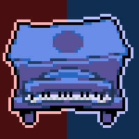
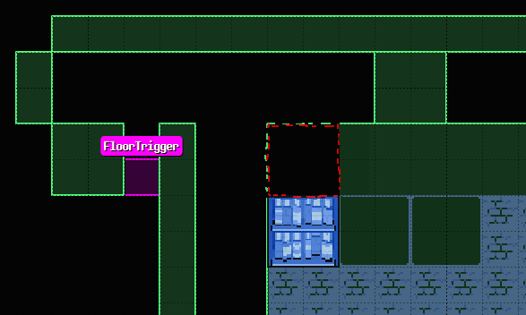
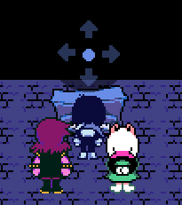
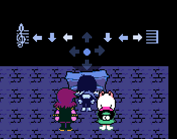
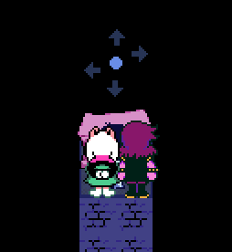
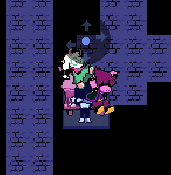

# Piano Puzzle Lib
This library implements all the piano puzzles from Deltarune Chapter 4!

**Anything shown or said here may change.**
**If you believe any information here is outdated or incorrect, please let me know!**

---

# Sections

## Moving Bookshelf Puzzles

To make a moving bookshelf puzzle you'll need these things:

A ``RemotePiano`` event with an object property ``"target"`` being a ``MovingBookshelf`` event, and an object layer called ``pianocollision``

In your pianocollision layer, Insert rectangles.
These will act as the boundaries to where the MovingBookshelf can move.

This is cool but what how do we stand on the bookshelves?

(bare with me)
You'll want to make 4 new object layers.
``objects_floor_1``, ``objects_floor_2``, ``collision_floor_1``, ``collision_floor_2``

Any objects within these layers will change depending on your current layer.

You should make ``collision_floor_1`` match what you would normally have on the ``collision`` layer.
(``collision_floor_2`` is special, we'll talk about that in a bit.)

So putting an event like ``Chest`` on ``objects_floor_2`` will make it inaccessible unless you're on layer 2.
But, how do we get to layer 2?

On your ``objects_party`` layer, make a rectangle event called FloorTrigger.
This will be where the player can move up and down the floors.

Now, why did I say ``collision_floor_2`` was special?
As you could probably guess, It's the walls the player can collide with on floor 2, BUT;
Not only are the rectangles walls for the player, they're the walls of the bookshelves.

That probably doesn't make much sense when written but I'll try.
The bookshelves "subtract" a 2x2 tile hole at it's current position.
This allows the player to walk on what would usually be the floor below (because it's cutting a hole in the collision)

## Password Pianos

(thankfully) These are much simpler.

On an object layer, Make a ``PasswordPiano`` event and give it the string property ``"pattern"``
This is the password that the piano will use.
Passwords are made up of these characters: ``u, d, l, r, c`` which represents: ``up, down, left, right, center``
You should now be able to see it in game but how will you tell the players what the password *is*?

Make a new PasswordPanel event and give it the following properties:
- ``"pattern"`` (``string``) should be the first or second half of your password.
- ``"part"`` (``string``) can be ``start`` or ``end`` (this shows the music sheet icon on the left or the right)
- ``"flag"`` (``string``) the flag that makes it appear. (You can either use a ``setflag`` event or make your own thing to change it.)
- ``"value"`` (``any``) the value the flag has to be to make it appear.
- ``"piano"`` (``object``) the piano it's tied to. (This makes the panel disappear after inputting the password.)

Also, You can make a ``MusicGat`` event with an object property called ``"piano"`` which should (obviously) be your piano.
This is the gate that's used 1 time. (I made this one in a day it was so simple)

## Moving Piano Segments
Similar to the Moving Bookshelf Puzzles, Make your pianocollision layer (this is the walls, blah blah blah)
Now the fun stuff, Make a ``MovingPiano`` event.

You can give it an object property called ``fakeout`` which should be a MovingBookshelf event.
This is like the first Moving Piano in the 2nd Sanctuary.

Also, You can make a ``PianoSpeedZone`` event which will change the piano's max speed when entering.
This takes in a float property called ``"max_speed"`` (do I need to explain this?)

Also Also, You can make a ``PianoJumpArea`` event which will make the piano jump when entering.

Also Also ***ALSO***, You can make a ``PianoExit`` event which will make the party jump off of the piano when entering. (this also makes the piano fly into oblivion)

# Object Properties
### RemotePiano
| Property | Type | Default | Values | Description |
|-|-|-|-|-|
| `target (target_1, target_2)` | `object` | `nil` | `MovingObject` | `The controllable object.` |
| `type` | `string` | `blue` | `blue, green, pink, red, twotone` | `Used for the sprites and icon. (Twotone enables controlling 2 objects at once.).` |
| `sprite` | `string` | `nil` | `any sprite` | `Overrides the current sprite.` |
| `camera_pos` | `marker` | `nil` | `Marker` | `Sets the camera pos instead of the currently controlled object.` |
| `camera_posx` | `float` | `nil` | `any number` | `Sets the camera posx.` |
| `camera_posy` | `float` | `nil` | `any number` | `Sets the camera posy.` |

### MovingBookshelf
| Property | Type | Default | Values | Description |
|-|-|-|-|-|
| `type` | `string` | `blue` | `blue, green, pink, red, twotone_green, twotone_purple` | `Used for the sprites and icon.` |
| `iconcolor` | `table (float)` | `COLORS.black` | `any RGBA table` | `The icon's color when inactive.` |
| `iconcolor_bright` | `table (float)` | `COLORS.gray` | `any RGBA table` | `The icon's color when active.` |
| `sound` | `string` | `musicbox` | `any sound` | `The sound played when moved.` |
| `max_speed` | `float` | `14` | `any float` | `The max speed the bookshelf can move.` |
| `can_slow_down` | `boolean` | `true` | `true, false` | `Can the bookshelf be slowed down by BreakableBookshelf.` |